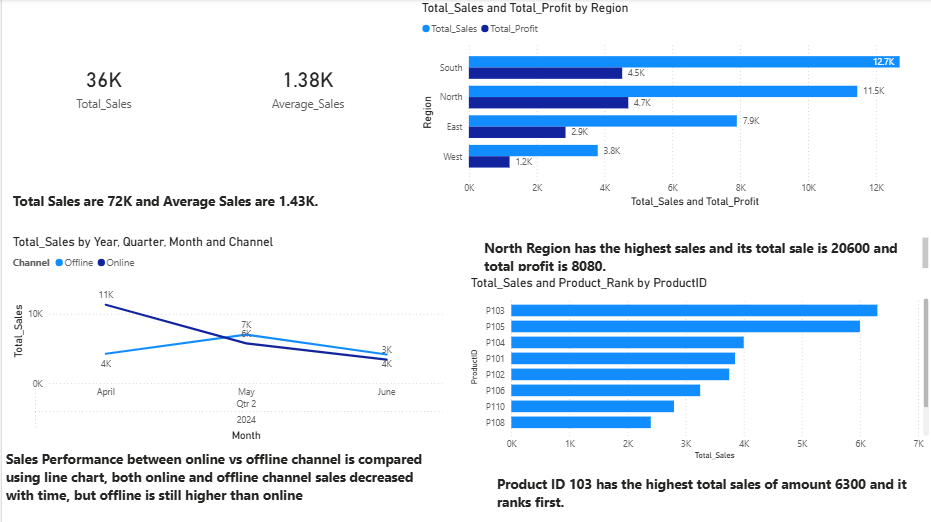
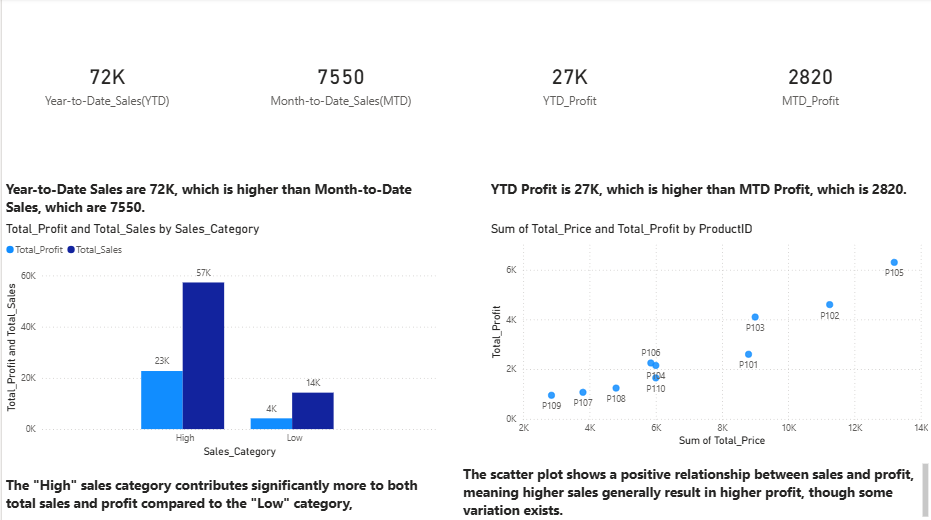

# PW_Skills_Power_BI_Assignments
## Project Overview
This repository contains Power BI assignments and reports that I completed as part of my PW Skills Data Analytics with Generative AI Course. It focuses on building interactive dashboards and converting raw data into meaningful business insights using Power BI.
## Tools & Technologies Used
1 . Power BI Desktop – for creating dashboards and reports
2 . Microsoft Excel / CSV – as data sources
3 . GitHub – to upload and organize reports
## Concepts Covered
### Data Cleaning & Transformation
- Used Power Query to clean and transform raw data.
- Handled missing values and formatted datasets for analysis
### Data Visualization
- Created interactive dashboards using charts, cards, and slicers.
- Used different visualizations like bar charts, line charts, and pie charts
### DAX (Data Analysis Expressions)
- Used basic DAX functions for calculations.
- Created calculated columns and measures.
### Dashboard Design
- Built user-friendly dashboards for better understanding.
- Focused on clear and simple presentation of insights
## Assignment Tasks
- Built reports based on given datasets.
- Practiced converting raw data into meaningful insights.
- Gained hands-on experience in creating dashboards for analysis.
## Key Learning 
- Learned how to transform and visualize data effectively.
- Improved ability to present insights in a structured way.
- Developed understanding of business-oriented data analysis.
  
## Week_15_Power_BI_Creating_Basic_Visualization_Assignment – Dashboard Preview

## Week_16_Power_BI_Introduction_to_DAX_Assignment – Dashboard Preview

## How to Use
### Clone this Repository
- Git Clone: <https://github.com/hafsa-ali-data-analyst/pwskills-sql-assignments.git>
- Open the Power BI (.pbix) file using Power BI Desktop to view and interact with the reports.
 ## Author
 **Hafsa Ali**
 
 Data Analyst | Data Analysis & Visualization (Excel, SQL,Python, Power BI, Tableau)
 
 Github: <https://github.com/hafsa-ali-data-analyst>
 ## License
 - This Repository is for learning and practice purpose only.
